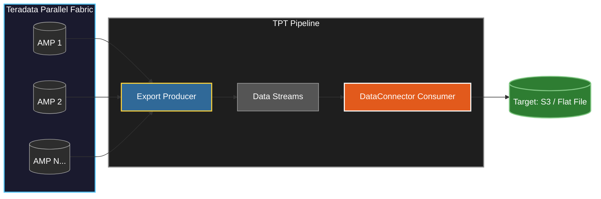

When dealing with massive datasets in Teradata, standard JDBC connections often become the bottleneck. To move **2 Billion+ records** efficiently, you need to bypass the SQL layer entirely and use **Teradata Parallel Transporter (TPT)**.

---

## Why TPT?

Standard SQL extractors pull data row-by-row through the SQL Parser and GDO (Global Distributed Object) layer — this is the primary bottleneck in any ODBC/JDBC connection.

TPT uses the **Export Operator**, which bypasses this layer entirely and pulls data in blocks directly from the **AMPs (Access Module Processors)**, enabling true massive parallelism.

---

## The Architecture


---

## How It Works

### 1. Producer Layer — Parallel Extraction

The Export Producer initiates **multiple sessions directly to the AMPs** simultaneously, rather than a single stream through the SQL layer.

Each AMP manages a portion of the data on disk. TPT pulls data blocks from all AMPs in parallel, so no single node becomes a bottleneck.

> **Performance Tip:** Set `MaxSessions` to match the number of AMPs (or a multiple) to ensure no AMP sits idle during the export.

---

### 2. Data Streams — In-Memory Buffering

The virtual data streams act as a **high-speed asynchronous buffer** between the Producer and Consumer layers.

This non-blocking design allows the Export Operator to keep reading from Teradata even if the writing side is momentarily slow — preventing backpressure from ever reaching the database.

---

### 3. Consumer Layer — High-Speed Writing

The DataConnector Consumer packages the parallel streams for the target destination using **block-level writing** instead of row-by-row I/O, significantly reducing write overhead.

---

## The Implementation

A standardized TPT script template for a high-speed export to a flat file:
```sql
DEFINE JOB EXPORT_LARGE_TABLE
DESCRIPTION 'High-speed export of 2B+ records'
(
  DEFINE OPERATOR file_writer
  TYPE DATACONNECTOR CONSUMER
  SCHEMA *
  ATTRIBUTES
  (
    VARCHAR FileName        = 'output_data.dat',
    VARCHAR Format          = 'DELIMITED',
    VARCHAR TextDelimiter   = '|'
  );

  DEFINE OPERATOR tptexp_operator
  TYPE EXPORT PRODUCER
  SCHEMA *
  ATTRIBUTES
  (
    VARCHAR TdpId           = 'your_tdpid',
    VARCHAR UserName        = 'your_user',
    VARCHAR UserPassword    = 'your_password',
    VARCHAR SelectStmt      = 'SELECT * FROM LARGE_PRODUCTION_TABLE;',
    INTEGER MaxSessions     = 16,
    INTEGER Tenacity        = 4,
    INTEGER Sleep           = 15,
    INTEGER BlockSize       = 64256
  );

  APPLY TO OPERATOR (file_writer)
  SELECT * FROM OPERATOR (tptexp_operator);
);
```

---

## Enterprise Tuning — The Pro Tips

| Parameter | Recommended Value | Why |
|---|---|---|
| `MaxSessions` | Match AMP count | Maximizes parallelism, no idle AMPs |
| `BlockSize` | `64256` or higher | Maximizes data per I/O operation |
| `Tenacity` | `4` | Retries for up to 1 hour before failing |
| `Sleep` | `15` | Seconds between retry attempts |

---

## Key Dependencies

To run this, your environment must have:

- **Teradata Client Tools (TTU)** — specifically the TPT Base and TPT Infrastructure packages
- **Proper Permissions** — the user needs `SELECT` access and sufficient `SPOOL` space to handle the export buffers