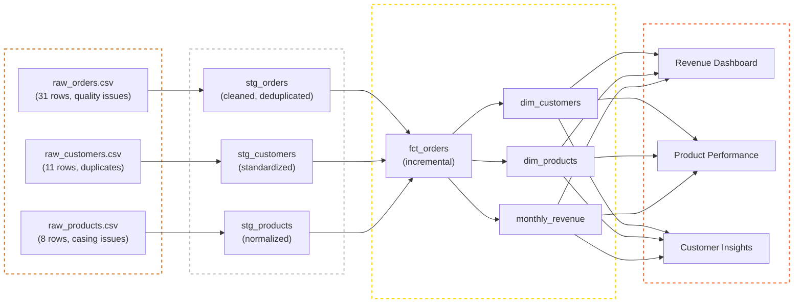

**Level:** Intermediate Data Engineering  
**Tech Stack:** dbt · Databricks · Delta Lake · SQL · Jinja · hive_metastore  
**Source Code & Practice Files:** [View on GitHub](https://github.com/arjun-sajeevan/arjunsajeevan.github.io/tree/main/projects-code/dbt-databricks-ecommerce)

---

## The Problem: Raw Data Is Useless

In my [beginner pipeline project](/projects/sales-ingestion-cleansing/), we learned how to ingest raw CSV data and clean it with Python. But there's a critical question that project doesn't answer:

> *Once the data is ingested — then what?*

In a real company, raw data lands in cloud storage every day. A dozen different analysts and data scientists need to query it — each writing their own transformations, often with subtle differences. One analyst filters out cancelled orders, another doesn't. One team reports revenue in cents, another in dollars. The result is a classic problem in data teams: **everyone has a different number, and nobody knows who is right.**

This is the problem that **Analytics Engineering** — and specifically **dbt** — was built to solve.

---

## The Solution: A Medallion Architecture on Databricks

Instead of everyone transforming raw data independently, we build a **single, shared transformation layer** — a structured data warehouse where transformations are:
- **Written in SQL** (readable by anyone)
- **Version-controlled in Git** (tracked like application code)
- **Automatically tested** (data quality is code, not hope)
- **Auto-documented** (a searchable docs site generated from YAML)

We implement this using the industry-standard **Medallion Architecture**:



Each layer has a clear contract: Bronze is raw and untouched, Silver is clean and typed, Gold is business-ready and analytical.

---

## The Bronze Layer: Raw Data with Intentional Problems

We load three CSV files into Databricks using `dbt seed`. Crucially, I've designed these files with **real-world data quality issues** baked in — the same problems you'd encounter in production:

| Table | Quality Issues |
|---|---|
| `raw_orders` | Duplicate `order_id`, one null `order_id`, one negative quantity, mixed-case status (`SHIPPED` vs `shipped`) |
| `raw_customers` | Duplicate customer record (C003 appears twice), inconsistent country casing (`india`, `INDIA`, `India`) |
| `raw_products` | Inconsistent category casing (`Electronics`, `electronics`, `ELECTRONICS`) |

These aren't mistakes — they're the teaching material. Every transformation in the Silver layer exists to fix one of these problems.

---

## The Silver Layer: Where the Real Work Happens

The staging models are the heart of this project. Let's walk through `stg_orders.sql` in detail:

```sql
with source as (
    select * from {{ source('ecommerce_bronze', 'raw_orders') }}
),

-- Step 1: Remove rows with null order_id
filtered as (
    select * from source
    where order_id is not null
),

-- Step 2: Deduplicate — order O001 appears twice, keep the earliest
deduplicated as (
    select * from (
        select *,
            row_number() over (
                partition by order_id
                order by order_date asc
            ) as row_num
        from filtered
    )
    where row_num = 1
),

-- Step 3: Clean and standardize
cleaned as (
    select
        order_id,
        customer_id,
        product_id,
        cast(order_date as date)                    as order_date,
        cast(quantity as int)                       as quantity,
        {{ cents_to_dollars('unit_price_cents') }}  as unit_price,  -- macro!
        upper(trim(status))                         as status,
        lower(trim(payment_method))                 as payment_method
    from deduplicated
),

-- Step 4: Filter negative quantities
final as (
    select * from cleaned
    where quantity > 0
)

select * from final
```

Notice the pattern: each CTE handles **exactly one concern**. This is intentional. When a bug appears in production, you trace back through the CTEs one at a time until you find the culprit. Readable SQL is debuggable SQL.

---

## dbt Superpower #1: The Macro

Notice `{{ cents_to_dollars('unit_price_cents') }}` in the query above. That's a **Jinja macro** — a reusable SQL function defined once and used everywhere:

```sql

    round({{ column_name }} / 100.0, 2)

```

Why `100.0` and not `100`? Because in SQL, dividing an integer by an integer performs **integer division** — `4999 / 100 = 49` (we lose the cents!). The `.0` forces float division: `4999 / 100.0 = 49.99`. If you ever need to change the rounding logic, you fix it in one place — not across every model that converts prices.

---

## The Gold Layer: Business-Ready Analytics

### `fct_orders` — The Incremental Fact Table

The fact table joins all three staging models into one enriched, queryable table:

```sql
{{ config(materialized='incremental', unique_key='order_id') }}

with orders    as (select * from {{ ref('stg_orders') }}),
     customers as (select * from {{ ref('stg_customers') }}),
     products  as (select * from {{ ref('stg_products') }})

select
    o.order_id, o.order_date, o.quantity,
    o.unit_price, o.quantity * o.unit_price as total_amount,
    o.status, o.payment_method,
    c.full_name as customer_name, c.country as customer_country,
    p.product_name, p.category as product_category, p.brand
from orders o
left join customers c on o.customer_id = c.customer_id
left join products  p on o.product_id  = p.product_id
```

---

## dbt Superpower #2: Incremental Models

The `fct_orders` model is materialized as **incremental** — one of dbt's most powerful features. Here's the logic that makes it work:

```sql

    where order_date > (select max(order_date) from {{ this }})

```

**Why does this matter?** Imagine your company has 3 years of order history — millions of rows. Without incremental, every dbt run rebuilds the entire table from scratch. That's expensive, slow, and unnecessary.

With `is_incremental()`:
- **First run:** Full table build (processes all history)
- **Every subsequent run:** Only processes orders newer than the latest date already in the table

In production, this cuts a 2-hour full rebuild down to a 3-minute incremental run.

---

## dbt Superpower #3: Testing as Code

This is where dbt changes how you think about data quality. Instead of manually checking tables, you declare your expectations as code in YAML:

```yaml
- name: stg_orders
  columns:
    - name: order_id
      tests:
        - not_null
        - unique
    - name: status
      tests:
        - accepted_values:
            values: ['DELIVERED', 'SHIPPED', 'CANCELLED', 'RETURNED']
```

Run `dbt test` and dbt generates SQL for each test, executes it against your Databricks tables, and reports results:

```
18 of 18 PASS ............................................................. [PASS in 12.3s]

Done. PASS=18 WARN=0 ERROR=0 SKIP=0 TOTAL=18
```

We also have a **custom singular test** for business logic that's too nuanced for schema tests. The rule: after staging filters, no order should have a negative quantity.

```sql
-- tests/assert_no_negative_quantity.sql
-- If this returns ANY rows, the test FAILS.
select order_id, quantity
from {{ ref('stg_orders') }}
where quantity <= 0
```

These tests run in CI pipelines at real companies. If a test fails, the deployment stops — bad data never reaches analysts.

---

## dbt Superpower #4: The `relationships` Test (FK Validation)

In the `_marts__models.yml`, we declare **foreign key validation** between tables:

```yaml
- name: customer_id
  tests:
    - relationships:
        to: ref('stg_customers')
        field: customer_id
```

dbt generates a SQL query that checks: does every `customer_id` in `fct_orders` exist in `stg_customers`? This is the equivalent of a database foreign key constraint — but running as a testable, trackable CI check.

---

## dbt Superpower #5: Auto-Generated Documentation
## dbt Superpower #4: Source Freshness (`dbt source freshness`)

We declare all three Bronze tables as dbt **sources** with freshness thresholds:

```yaml
sources:
  - name: ecommerce_bronze
    freshness:
      warn_after: {count: 24, period: hour}
      error_after: {count: 48, period: hour}
    loaded_at_field: "current_timestamp()"
```

Running `dbt source freshness` checks whether your source data has been updated within the expected window. In production pipelines, this is how data teams detect when an upstream ETL job silently fails.

---

## dbt Superpower #5: The Auto-Generated Lineage Graph

After running `dbt docs generate && dbt docs serve`, open `localhost:8080` and click the graph icon in the bottom-right. This is what you see:


This diagram was **generated automatically** from your `ref()` calls in SQL. dbt reads your code, understands the dependencies, and draws this for free. You never have to maintain a data flow diagram again — it updates every time you run `dbt docs generate`.

Notice `fct_orders` in the centre (highlighted purple) — it is the hub of the entire warehouse. Three sources flow into it, and three mart tables flow out of it. This is the Medallion Architecture made visible.

---

## The Gold Layer: Dimension Tables

`dim_customers` aggregates from `fct_orders` to give each customer a complete business profile:

| Column | Description |
|---|---|
| `lifetime_value` | Total revenue across all orders |
| `total_orders` | How many times they've ordered |
| `first_order_date` | Acquisition date |
| `return_rate_pct` | % of orders returned |
| `avg_order_value` | Spend per order |

`dim_products` similarly aggregates sales metrics per product — total units sold, confirmed units (delivered only), and total revenue.

`monthly_revenue` is the "executive summary" table: one row per month with order count, unique customers, total revenue, average order value, and the **top-performing category** for that month — derived using a window function.

---

## SQL Analytics in Databricks

After `dbt run`, the Gold-layer tables are live and queryable directly in the **Databricks SQL Editor**. No additional BI tool needed — Databricks has built-in chart visualizations.

### Revenue by Payment Method

```sql
SELECT
    payment_method,
    COUNT(DISTINCT order_id)    AS total_orders,
    ROUND(SUM(total_amount), 2) AS total_revenue
FROM dev.ecommerce_gold.fct_orders
WHERE status IN ('DELIVERED', 'SHIPPED')
GROUP BY payment_method
ORDER BY total_revenue DESC;
```


**Business insight:** Credit card customers account for over 55% of total revenue. A real business would use this to prioritise their payment gateway partnerships.

---

### Product Revenue Performance

```sql
SELECT product_name, category, total_revenue, total_units_sold
FROM dev.ecommerce_gold.dim_products
ORDER BY total_revenue DESC;
```


**Business insight:** Wireless Headphones generates 2x the revenue of the next best product (Laptop Pro 15), despite both being Electronics. This is the kind of signal a product team would act on immediately — expand the headphones range, investigate the laptop.

---

### Customer Lifetime Value

```sql
SELECT full_name, country, total_orders, lifetime_value
FROM dev.ecommerce_gold.dim_customers
WHERE total_orders IS NOT NULL
ORDER BY lifetime_value DESC;
```


**Business insight:** The top 3 customers (Carlos Garcia, Aisha Patel, Arjun Sajeevan) each account for over $150 in lifetime value. A retention campaign targeting this cohort would protect a significant portion of revenue.

---

## How to Follow Along

Everything you need is in the GitHub repo. Here's the full run sequence:

```bash
# 1. Install dbt
pip install dbt-databricks

# 2. Copy the profile template and fill in your credentials
cp profiles.yml.example ~/.dbt/profiles.yml

# 3. Install packages
dbt deps

# 4. Test your connection
dbt debug

# 5. Load raw data into Databricks
dbt seed

# 6. Build the warehouse
dbt run

# 7. Run all 18 tests
dbt test

# 8. Generate and explore the docs + lineage graph
dbt docs generate && dbt docs serve

# 9. Check source freshness
dbt source freshness
```

Then open the Databricks SQL Editor and run the queries in `analytics/` to build your charts.

---

## Engineering Decisions

**Why views for staging, tables for marts?**  
Staging models are cheap to recompute — they're just SQL on top of seeds. Building them as views means they always reflect the latest raw data without using Databricks compute. Marts are queried frequently by dashboards, so they need to be pre-computed tables for fast response times.

**Why left join (not inner join) in `fct_orders`?**  
An inner join would silently drop orders if a `customer_id` or `product_id` doesn't match — a data loss bug that's hard to detect. Left join preserves all orders and leaves customer/product columns null if there's no match. The `relationships` test then catches these orphaned records explicitly.

**Why is the monthly_revenue model not incremental?**  
Monthly aggregates need to be recalculated whenever historical data changes (late-arriving orders, status updates). An incremental strategy would be wrong here — we need a full rebuild to get accurate monthly totals. For a 3-month dataset, a full rebuild takes milliseconds anyway.

---

## Key Takeaways

1. **dbt makes SQL a first-class engineering artifact.** Version-controlled, tested, documented SQL is fundamentally different from ad-hoc queries.

2. **The Medallion Architecture is not just a pattern — it's a contract.** Every layer has a specific responsibility. Bronze is raw, Silver is clean, Gold is business-ready.

3. **Incremental models are the difference between a pipeline and a production pipeline.** Always ask: "Do I need to reprocess historical data on every run?"

4. **Test your data like you test your code.** `dbt test` in CI means data quality failures block deployments — exactly like unit test failures.

5. **Documentation is a deliverable, not an afterthought.** The `dbt docs` site is the gift you give to every analyst who comes after you.

---

## Project Resources

Ready to build this yourself? Everything is in the repo — seeds, models, macros, tests, and analytics SQL files.

👉 **[View the Full Project on GitHub](https://github.com/arjun-sajeevan/arjunsajeevan.github.io/tree/main/projects-code/dbt-databricks-ecommerce)**

---
