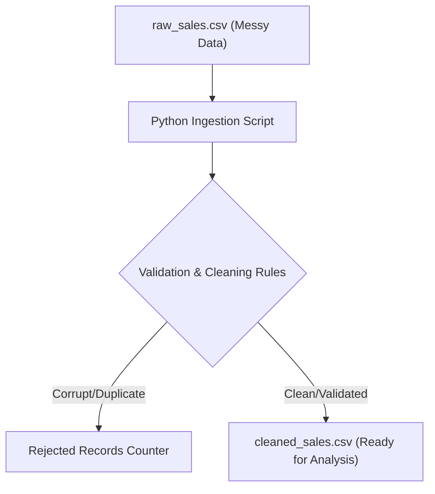

**Level:** Beginner (Foundations)  
**Tech Stack:** Python · CSV · Clean Code Design  
**Source Code & Practice Files:** [View on GitHub](https://github.com/arjun-sajeevan/arjunsajeevan.github.io/tree/main/projects-code/sales-ingestion-cleansing)

---

## Welcome to Data Engineering!

If you are just starting out in data engineering, you might be overwhelmed by tools like PySpark, Airflow, Snowflake, or Databricks. But here's a secret: **you don't need any of those to understand the fundamentals of data engineering.**

Every enterprise data platform starts with one core concept: **Ingestion**. Before data can be analyzed, it must be loaded, cleaned, and verified. 

In this project, we are going back to basics. I built a local Python batch processing pipeline—using just standard Python (no complex frameworks!)—that ingests a raw, messy CSV sales dataset, standardizes data types, removes duplicates, filters invalid records, and outputs a clean CSV file ready for downstream analysis.

Think of this as a **teaching tool**. I have provided the sample files and code so you can practice this yourself and understand the foundation!

---

## Architecture & Data Flow

Even though we're building this locally, the architecture mirrors what you'd see in an enterprise environment:



The pipeline operates **row-by-row** to minimize memory usage. This is crucial in data engineering: we only hold one record in memory at any given time, meaning this script could theoretically process massive files without crashing your computer!

---

## How to Practice This Yourself

You can find all the files for this project in the [projects-code folder](https://github.com/arjun-sajeevan/arjunsajeevan.github.io/tree/main/projects-code/sales-ingestion-cleansing) on my GitHub.

1. Download `raw_sales.csv` and `ingest.py`.
2. Open the code and read through the functions.
3. Run `python ingest.py` in your terminal.
4. Try modifying `raw_sales.csv` to add your own messy data and see how the pipeline handles it!

---

## Key Engineering Challenges & Solutions

Here are the foundational problems we solve in this project:

### 1. Robust Type Parsing (Defensive Programming)
Raw text formats (like CSV) store all columns as strings. To perform math, we must convert values like `" $14.50 "` and `"N/A"` into float numbers or `None` without crashing the entire script.

I created type-safe helper functions that wrap conversions in `try-except` blocks:

```python
def clean_price(price_str):
    if not price_str:
        return None
    # Strip spaces and dollar signs
    clean_str = price_str.strip().replace("$", "")
    try:
        return float(clean_str)
    except ValueError:
        return None
```

### 2. Multi-Format Date Standardisation
Dates in the raw source are often formatted inconsistently (e.g. `YYYY-MM-DD` and `YYYY/MM/DD`). We use a loop to check multiple configurations, converting all successful hits to the ISO standard `YYYY-MM-DD`:

```python
def parse_date(date_str):
    if not date_str:
        return None
    clean_str = date_str.strip()
    for fmt in ["%Y-%m-%d", "%Y/%m/%d"]:
        try:
            return datetime.strptime(clean_str, fmt).strftime("%Y-%m-%d")
        except ValueError:
            continue
    return None
```

### 3. Hashed In-Memory Deduplication
Network retries often cause duplicate events. We use a Python `set()` of transaction IDs to check if a row was already processed. If it was present in the set, the record is skipped.

```python
if txn_id in seen_transactions:
    rejected_duplicates += 1
    continue
seen_transactions.add(txn_id)
```

### 4. Metrics-Driven Ingestion Report
A silent failure is a data engineer's worst nightmare! If data is missing, we need to know why. The script tracks the processing state of every single row, printing a detailed **Pipeline Audit Report** on completion:

```text
--- Pipeline Audit Report ---
📥 Total Raw Records Processed: 12
📤 Cleaned Records Exported:    5
❌ Rejected Records Details:
   - Missing TXN ID:         1
   - Duplicates:             2
   - Invalid/Missing Date:   1
   - Invalid/Missing Price:  1
   - Invalid/Missing Qty:    1
   - Missing Product ID:     1
-----------------------------
```

---

## Key Takeaways for Beginners

1. **Keep Raw Immutable**: Raw files are never modified. Ingestion must always be repeatable. If you mess up, you can always delete `cleaned_sales.csv` and try again.
2. **Crash Prevention**: Upstream formats cannot be trusted. Type casting must be protected by error-handling logic.
3. **Traceability**: Auditing statistics must be logged so data engineering teams can track data health metrics over time.

Welcome to the world of Data Engineering!
