**Level:** Intermediate to Advanced Data Engineering  
**Tech Stack:** Python · Apache Kafka · Docker · PySpark Structured Streaming · JVM

---

## The Problem: Batch is Too Slow

In modern e-commerce, waiting 24 hours to analyze sales data is no longer acceptable. Businesses need to know what is selling *right now* — to manage inventory, detect fraud, and trigger real-time marketing.

To solve this, I designed and built a decoupled, event-driven streaming architecture locally. This project serves as a blueprint for how enterprise companies move from static batch processing to real-time **data-in-motion**.

---

## Architecture Overview

The pipeline is broken into three distinct, decoupled layers:

```mermaid
flowchart LR
    subgraph Ingestion["1️⃣ The Ingestion Layer"]
        A["📄 CSV Source<br/>(online_retail.csv)"]
        B["🐍 Python Producer<br/>Edge Simulator"]
    end

    subgraph Transport["2️⃣ The Transport Layer (Docker)"]
        C["🚀 Apache Kafka<br/>Topic: retail-transactions"]
    end

    subgraph Analytics["3️⃣ The Analytics Layer"]
        D["🧠 PySpark<br/>Structured Streaming"]
        E["📊 Live<br/>Micro-Batch Output"]
    end

    A --> B --> C --> D --> E

    %% Node Styling
    style A fill:#4A4A4A,stroke:#888,color:#fff
    style B fill:#306998,stroke:#FFD43B,stroke-width:2px,color:#fff
    style C fill:#231F20,stroke:#FFFFFF,stroke-width:2px,color:#fff
    style D fill:#E25A1C,stroke:#fff,stroke-width:2px,color:#fff
    style E fill:#2E7D32,stroke:#81C784,stroke-width:2px,color:#fff

    %% Layer Box Styling (Transparent with colored dashed borders)
    style Ingestion fill:none,stroke:#306998,stroke-width:2px,stroke-dasharray: 5 5,color:#fff
    style Transport fill:none,stroke:#4fc3f7,stroke-width:2px,stroke-dasharray: 5 5,color:#fff
    style Analytics fill:none,stroke:#E25A1C,stroke-width:2px,stroke-dasharray: 5 5,color:#fff
```

---

## How It Works

### 1. The Ingestion Layer — Python Producer

In the real world, data originates from Point-of-Sale (POS) systems or website click events. To simulate this, I wrote a Python producer that reads a static historical dataset (`online_retail.csv`) row by row.

Rather than sending raw strings, the producer acts as an **edge device**: it serializes each row into JSON and encodes it as UTF-8 bytes before publishing. This ensures data is strictly structured before it ever hits the network.

---

### 2. The Transport Layer — Kafka via Docker

**Why not send data directly from Python to Spark?** Backpressure.

If the analytics engine goes down, or if there is a massive spike during a Black Friday sale, a direct connection would drop data entirely. I deployed **Apache Kafka** and **Zookeeper** using Docker to solve this.

Kafka acts as a highly durable "Post Office":
- Catches all incoming JSON events
- Organizes them into a dedicated topic (`retail-transactions`)
- Holds them safely until downstream consumers are ready

---

### 3. The Analytics Layer — PySpark Consumer

To process the stream, I used **PySpark Structured Streaming**. While a simple Python script could read Kafka messages, PySpark is a distributed engine capable of scaling to millions of rows per second across a cluster.

The PySpark consumer:
1. Subscribes to the Kafka topic
2. Casts raw binary data back into readable strings
3. Applies a strict schema (Integers, Doubles, Strings) to transform messy JSON into a structured, queryable DataFrame
4. Outputs results in real-time micro-batches

---

## Engineering Challenge: Navigating Dependency Hell

Building this pipeline wasn't just about writing code — it required deep **systems-level debugging**.

When connecting PySpark to Kafka, the pipeline suffered fatal crashes with:
- `[JAVA_GATEWAY_EXITED]`
- `scala.collection.mutable.WrappedArray — NoSuchMethodError`

### Diagnosis

I traced these errors to a **binary incompatibility deep within the JVM**. My local PySpark engine (v3.5.0) was compiled against **Scala 2.13**, but it was attempting to load a Kafka connector built for **Scala 2.12** — where `WrappedArray` still existed. On top of this, the PySpark Java Gateway was clashing with my Mac's default Java 11 environment.

### Resolution

| Action | Purpose |
|---|---|
| Cleared the corrupted Ivy cache (`~/.ivy2/`) | Removed stale, incompatible JARs |
| Pinned terminal session to OpenJDK 17 | Resolved Java Gateway exit errors |
| Explicitly fetched `spark-sql-kafka-0-10_2.13:3.5.0` | Aligned Scala versions across the stack |

> **Key takeaway:** Code is only as stable as the environment it runs in. Resolving JVM-level dependency conflicts is a core skill in production Data Engineering.

---

## Outcome

The completed pipeline successfully streams, processes, and prints structured micro-batch DataFrames from a live Kafka topic — fully locally, with no cloud dependency — demonstrating an architecture that mirrors enterprise-grade production systems.

---

## Project Resources
Ready to explore the code? You can find the complete implementation, including the Docker configuration and both Python scripts, in the official repository:

👉 **[View Project on GitHub](https://github.com/arjun-sajeevan/arjunsajeevan.github.io/tree/main/projects-code/realtime-ecommerce-pipeline)**

---